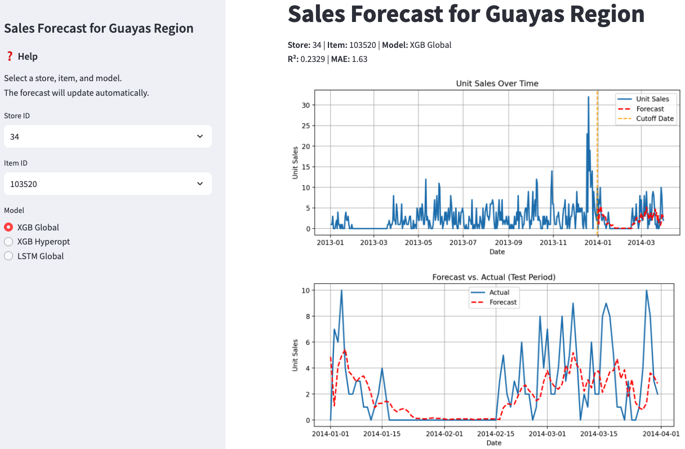

# Retail Demand Analysis – Favorita Grocery Sales Forecasting
Project used with Advanced Time Series Machine Learning


## Objectives

- Perform time series analysis on sales data from Favorita grocery stores
- Conduct feature engineering with holidays, promotions, oil prices, and more
- Compare and evaluate forecasting models (ARIMA, Prophet, XGBoost, etc.)
- Visualize trends, seasonality, and forecast outcomes
- Build a reusable and reproducible data analysis pipeline

---

## Running the App

```bash
streamlit run app/app.py
```

- Open the app in your browser.
- Select **Store ID**, **Item ID**, and a **Model** from the sidebar.
- View forecast charts, error metrics (MAE, R²), and forecast table.



---

## Forecasting Models

| Model            | Description                              |
|------------------|------------------------------------------|
| XGB Global       | Global XGBoost model for all items/stores |
| XGB Hyperopt     | Individually tuned XGBoost with Optuna    |
| LSTM Global      | LSTM-based forecasting (scaled features)  |

---
## Example Forecast Output

| Date       | Actual | Forecast |
|------------|--------|----------|
| 2014-01-01 | 0      | 2.70     |
| 2014-01-02 | 3      | 1.08     |
| 2014-01-03 | 2      | 2.57     |
| ...        | ...    | ...      |

---

## Project Structure

```
RETAIL_DEMAND_ANALYSIS/
├── app/                          # Streamlit application
│   ├── __init__.py               # Makes this a package
│   ├── app.py                    # Main Streamlit app logic
│   └── config.py                 # Configuration settings (e.g., paths, cutoff dates, title)
│
├── data/                         # Data loading & preprocessing
│   ├── __pycache__/              # Python bytecode cache (ignored)
│   ├── preprocessed_data/        # Cleaned and ready-to-use data
│   ├── retail_kaggle_data/       # Raw input CSVs from Kaggle dataset
│   ├── __init__.py               # Makes this a package
│   └── data_utils.py             # Utility functions for data handling
│
├── mlruns/                       # MLflow tracking (ignored in Git)
│
├── model/                        # Forecasting models and utilities
│   ├── __pycache__/              # Python bytecode cache (ignored)
│   ├── lstm/                     # Code or models specific to LSTM
│   ├── scaler/                   # Saved scalers for LSTM normalization
│   ├── xgb/                      # XGBoost model artifacts
│   ├── __init__.py               # Package initialization
│   └── model_utils.py            # Main logic for running forecasts (e.g., run_forecast)
│
├── notebooks/                    # Jupyter notebooks for experimentation
│   ├── 1_TS_Project_Favorita_Grocery_Sales_Preprocessing.ipynb
│   ├── 2_TS_Project_Favorita_Grocery_Sales_Forecasting.ipynb
│   └── 3_TS_Project_Favorita_Grocery_Sales_Backup.ipynb   # Ignored via .gitignore
│
├── .gitignore                    # Excludes .csv, .7z, .png, backup notebooks, etc.
├── LICENSE                       # MIT License
├── README.md                     # Project overview and usage guide
├── requirements.txt              # Python dependencies for the project
```

---

## Dataset

- Source: [Kaggle Competition](https://www.kaggle.com/competitions/store-sales-time-series-forecasting)
- Not included in the repository due to size. Add CSV files to:
  - `data/retail_kaggle_data/`
  - `data/preprocessed_data/`
- Data for Model calculation:
  - Source_1: [train.csv](https://drive.google.com/file/d/1-7S9_L8r9_fFZo9a-5htkEg8HE0rTDiM/view?usp=sharing)
  - Source_2: [train_guayas_prepared.csv](https://drive.google.com/file/d/1d88sCAmvrbujI2ObzEqOErUI2zZG9yuE/view?usp=sharing) 
  - Source_3: [train_guayas_model_ready.csv](https://drive.google.com/file/d/16Sr31NGSL15RfSMHpNiAczNF8D7ZPf1G/view?usp=sharing)

---

## Installation

```bash
git clone https://github.com/LarsPetschke/retail_demand_analysis.git
cd retail_demand_analysis
pip install -r requirements.txt
```

> **Note**: Datasets are not included in the repo. Place them in `data/retail_kaggle_data/`.

---

## Technologies Used

- **Python 3.11+**
- **Pandas, NumPy**
- **Matplotlib, Seaborn**
- **scikit-learn**
- **statsmodels**
- **Prophet / XGBoost**
- **Jupyter Notebooks**
- **Streamlit**

---
## License

This project is licensed under the MIT License – see [LICENSE](LICENSE) for details.

---

## Author

**Lars Petschke**  

Feel free to connect or contribute!
